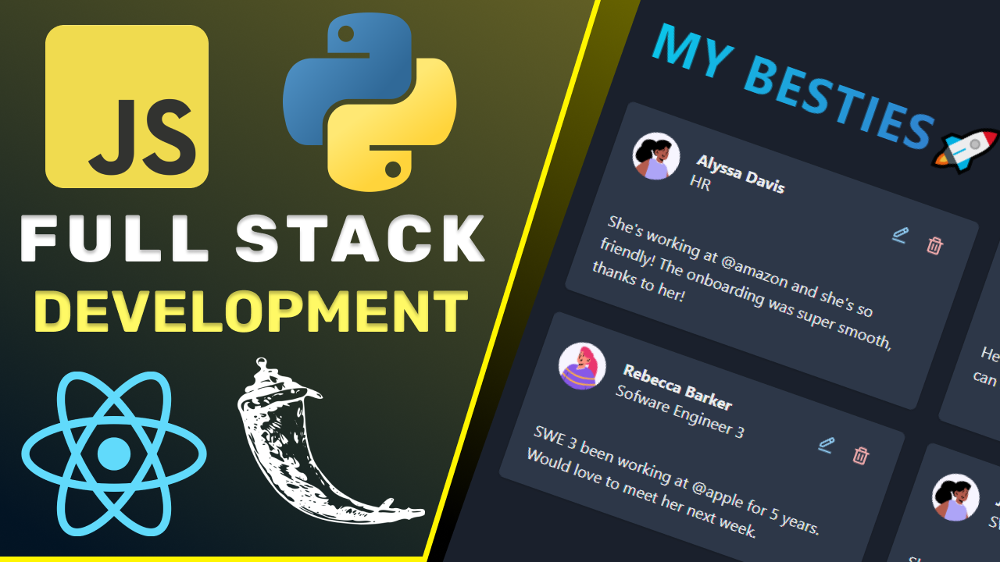
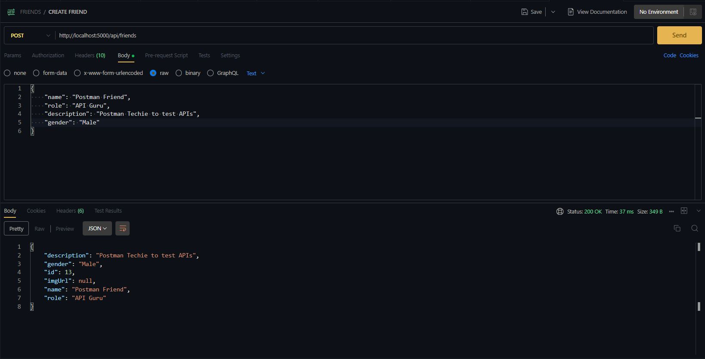
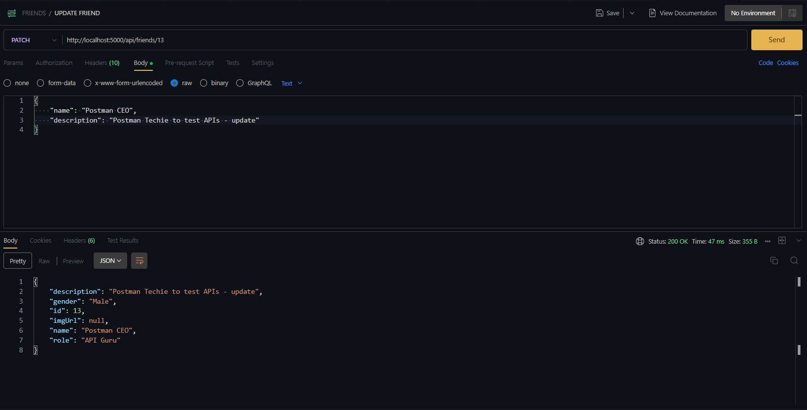
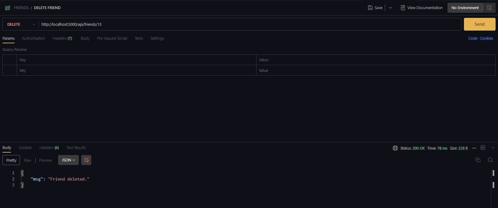
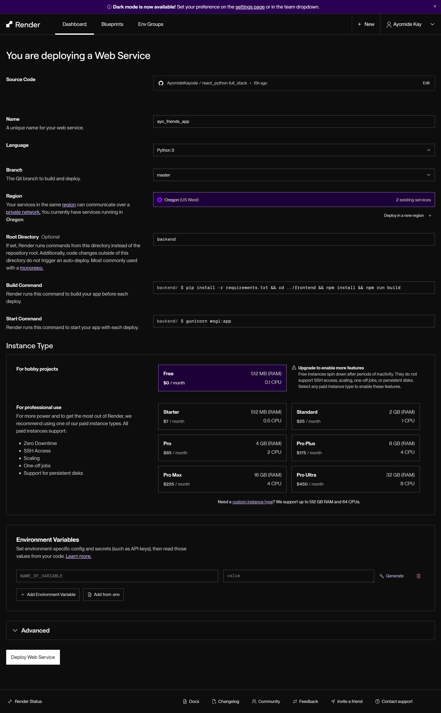

# Friend Store 🚀

Build a Friend Store with Python(Flask) and JavaScript(React)



[Visit Site here](https://ayo-friends-app.onrender.com)

## Table of Contents

- ⚙️ Tech Stack: Python, React, SQLite, SQLAlchemy, Flask, Chakra UI
- ✅ CRUD Functionality: Seamlessly create, read, update, and delete friends from your store.
- 🔒 Best Practices: Utilizes best practices such as creating virtual environments (venv) for a clean and isolated development environment.
- 🌐 Deployment: Deployed on Render for free.
- 🎨 Stylish UI Components: Enhanced user experience with stylish UI components provided by Chakra UI.
- 🌓 Light and Dark Mode: Enjoy a personalized user interface experience with light and dark mode options.
- 📱 Responsive Design: The app is designed to adapt to various screen sizes, ensuring a consistent experience across devices.

## Run the App Locally

i. Clone the repository:

```bash
git clone https://github.com/burakorkmez/react-python-tutorial
```

ii. Navigate to the project directory:

```bash
cd react-python-tutorial
```

iii. Navigate to the backend directory:

```bash
cd backend
```

iv. Create a virtual environment:

- On macOS and Linux:

```bash
python3 -m venv venv
```

- On Windows:

```bash
python -m venv venv
```

v. Activate the virtual environment:

- On macOS and Linux:

```bash
source venv/bin/activate
```

- On Windows:

```bash
venv\Scripts\activate
```

vi. Install the dependencies:

- On macOS and Linux:

```bash
pip3 install -r requirements.txt
```

- On Windows:

```bash
pip install -r requirements.txt
```

vii. Navigate to the frontend directory:

```bash
cd ../frontend
```

viii. Install the dependencies:

```bash
npm install
```

ix. Build the frontend:

```bash
npm run build
```

x. Navigate to the backend directory:

```bash
cd ../backend
```

xi. Run the Flask app:

```bash
flask run --reload
```

xii. Open your browser and go to `http://localhost:5000/` to view the app.

<!-- xiii. Don't forget to Like && Subscribe 🚀 -->

## Python and React App

```bash
(web_venv) ayomide@Kazzywiz:~/react_python-full_stack/backend$ python3 app.py
 * Serving Flask app 'app'
 * Debug mode: on
WARNING: This is a development server. Do not use it in a production deployment. Use a production WSGI server instead.
 * Running on http://127.0.0.1:5000
Press CTRL+C to quit
 * Restarting with stat
 * Debugger is active!
 * Debugger PIN: 139-713-209
127.0.0.1 - - [20/Jul/2024 11:15:50] "GET / HTTP/1.1" 404 -
127.0.0.1 - - [20/Jul/2024 11:15:53] "GET /favicon.ico HTTP/1.1" 404 -
127.0.0.1 - - [20/Jul/2024 11:15:55] "GET /contacts HTTP/1.1" 404 -
127.0.0.1 - - [20/Jul/2024 11:16:01] "GET /api/friends HTTP/1.1" 404 -
^C(web_venv) ayomide@Kazzywiz:~/react_python-full_stack/backend$ export FLASK_APP=app.py
(web_venv) ayomide@Kazzywiz:~/react_python-full_stack/backend$ export FLASK_ENV=development
(web_venv) ayomide@Kazzywiz:~/react_python-full_stack/backend$ flask run --debug
```

- Making use of avatars from an external API

## Sending a GET Request with JSON Data


## Sending a POST Request with JSON Data

- To test the API's functionality for creating a new friend record, I utilized `Postman`, a popular API testing tool.
- Also available as a VSCode extension.

Here's the step-by-step process I followed:

- Set the URL: Entered the endpoint URL (`http://127.0.0.1:5000/api/friends`) in Postman's address bar.
- Choose the HTTP Method: Selected `POST` from the HTTP method dropdown.
- Set the Headers: Added a new header with `Key: Content-Type` and `Value: application/json` to ensure the server processes the request as JSON.
- Set the Body: Chose the `raw` option under the `Body` tab, selected `JSON` from the dropdown, and input the JSON data:

```json
{
    "name": "Ayomide Kayode", whatever you like
    "role": "Developer",
    "description": "A skilled full stack developer😁",
    "gender": "male"
}
```

- Send the Request: Clicked the `Send` button to submit the request.

Upon correctly setting the headers and body, the server successfully processed the request, resulting in a success message confirming the creation of the new friend record. This step is crucial for ensuring that the server understands the format of the incoming data and can handle it appropriately.



## Sending a UPDATE Request with JSON Data

- Set the URL: Entered the endpoint URL (`http://127.0.0.1:5000/api/friends/<int:id>`) in Postman's address bar.
- Take note to add the `id` of the user to update in the endpoint URL.
- Choose the HTTP Method: Selected `PATCH` from the HTTP method dropdown.
- Set the Headers: Added a new header with `Key: Content-Type` and `Value: application/json` to ensure the server processes the request as JSON.
- Set the Body: Chose the `raw` option under the `Body` tab, selected `JSON` from the dropdown, and input the JSON data of the fields you would want to make changes to:

```json
{
  "name": "Ayomide Kayode",
    "role": "Product Designer",
    "description": "A UI/UX Designer😁"
}
```

- Send the Request: Clicked the `Send` button to submit the request.



## Sending a DELETE Request with JSON Data

- Set the URL: Entered the endpoint URL (`http://127.0.0.1:5000/api/friends/<int:id>`) in Postman's address bar.
- Take note to add the `id` of the user to delete in the endpoint URL.
- Choose the HTTP Method: Selected `DELETE` from the HTTP method dropdown.

- Send the Request: Clicked the `Send` button to submit the request.



## Deployment

Site was deployed on [Render](https://render.com/) free hosting. Easy to use, just link to your github and deploy.


