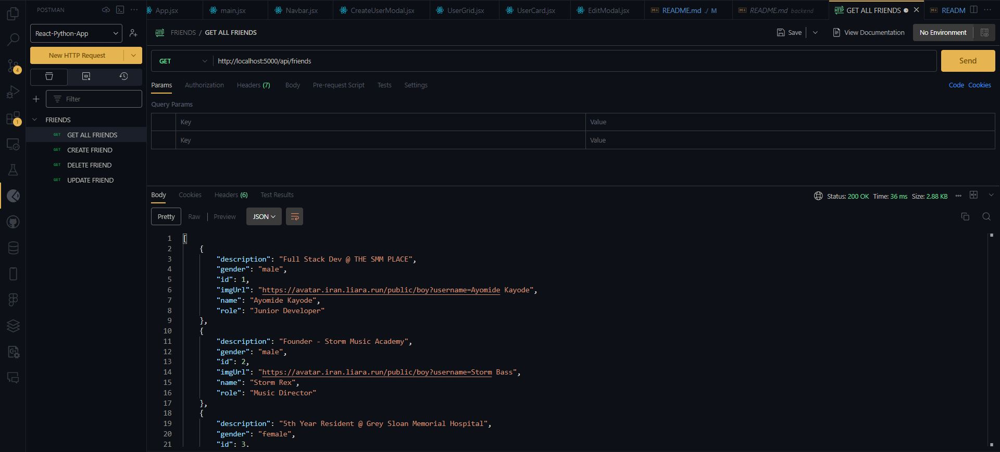
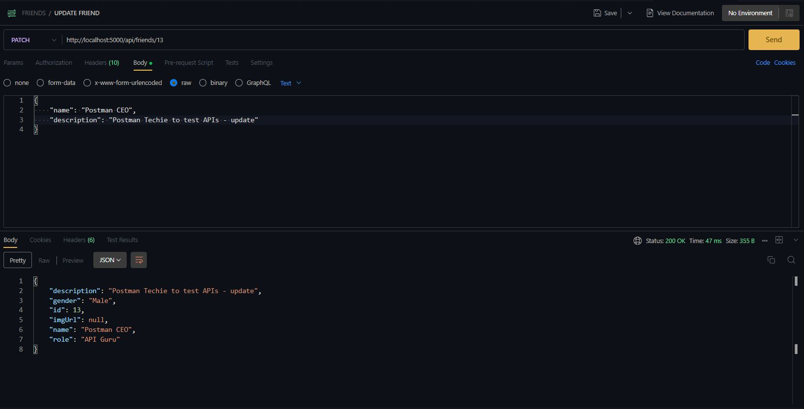

# Friends API

## Introduction

Hi there, welcome to the friends API 🚀.

This project is a simple friend management application built using Flask. It provides a RESTful API to create, retrieve, update, and delete friend records in a SQLite database. The project also integrates an external API to fetch avatar images based on the gender of the friends.

## Table of Contents

- [Installation](#installation)
- [Usage](#usage)
- [API Endpoints](#api-endpoints)
- [Create a New Friend](#create-a-new-friend)
- [Get All Friends](#get-all-friends)
- [Update a Friend's Profile](#update-a-friends-profile)
- [Delete a Friend](#delete-a-friend)
- [Models](#models)
- [Routes](#routes)

### Installation

To get started with the project, follow these steps:

- Clone the repository:

```bash
git clone https://github.com/AyomideKayode/react_python-full_stack.git
cd react_python-full_stack/backend
```

- Create and activate a virtual environment:

```bash
python3 -m venv web_venv
source web_venv/bin/activate
```

- Install the required dependencies:

```bash
pip install -r requirements.txt
```

- Run the application

`flask run --reload or --debug`

### Usage

Once the application is running, you can interact with the API using tools like Postman or cURL. The base URL for all endpoints is `http://127.0.0.1:5000/api/friends`.

### API Endpoints

#### Create a new friend

_`POST /api/friends`_

- Endpoint: `POST /api/friends`
- Description: Creates a new friend record in the database.
- Headers:
  - `Content-Type: application/json`
- Request Body:

  ```json
  {
    "name": "John Doe",
    "role": "Developer",
    "description": "A skilled developer",
    "gender": "male"
  }
  ```

- Responses:

  - Success `200 OK`: Returns {"status": "OK"}

  ```json
  {
    "msg": "Friend created successfully"
  }
  ```

  - Error `400 Bad Request` if any required field is missing

  ```json
  {
    "error": "Missing required field: name"
  }
  ```

  - Error: `500 Internal Server Error` if an exception occurs

  

#### Get All Friends

_`GET /api/friends`_

- Endpoint: `GET /api/friends`
- Description: Retrieves all friend records from the database.
- Responses:

  - Success `200 OK`

  ```json
  [
    {
        "id": 1,
        "name": "John Doe",
        "role": "Developer",
        "description": "A skilled developer",
        "gender": "male",
        "imgUrl": "https://avatar.iran.liara.run/public/boy?username=John Doe"
    },
    ...
  ]
  ```

  - Error: `500 Internal Server Error` if an exception occurs

  

#### Update a Friend's Profile

_`PATCH /api/friends/2`_

- Endpoint: `PATCH /api/friends/<int:id>`
- Description: Updates an existing friend's profile with new data. If any data field is not provided, the old data is retained.
- Headers:
  - `Content-Type: application/json`
- Request Body:

  ```json
  {
    "name": "Jane Doe",
    "role": "Designer",
    "description": "A creative designer",
    "gender": "female"
  }
  ```

- Responses:

  - Success `200 OK`

  ```json
  {
    "id": 1,
    "name": "Jane Doe",
    "role": "Designer",
    "description": "A creative designer",
    "gender": "female",
    "imgUrl": "https://avatar.iran.liara.run/public/girl?username=Jane Doe"
  }
  ```

  - Error: `404 Not Found` if the friend is not found

  ```json
  {
    "error": "Oops, friend not found."
  }
  ```

  - Error: `500 Internal Server Error` if an exception occurs

  

#### Delete a Friend

_`DELETE /api/friends/2`_

- Endpoint: `DELETE /api/friends/<int:id>`
- Description: Deletes a friend record from the database.
- Responses:

  - Success `200 OK`

  ```json
  {
    "msg": "Friend deleted."
  }
  ```

  - Error: `404 Not Found` if the friend is not found

  ```json
  {
    "error": "Oops, friend not found."
  }
  ```

  - Error: `500 Internal Server Error` if an exception occurs

  

### Models

#### Friends

The Friend model represents a friend record in the database. It includes the following fields:

- `id`: Integer, primary key
- `name`: String, required
- `role`: String, required
- `description`: Text, required
- `gender`: String, required
- `img_url`: String, optional

The `Friend` model also includes a `to_json` method that converts a `Friend` object to a JSON object.

### Routes

#### Get All Friends Route

- Define a route to retrieve all friends from the database.
- Query the database for all friends.
- Convert the list of friend objects to JSON format and return as a response.

#### Create a New Friend Route

- Define a route to create a new friend.
- Extract the JSON data from the request.
- Check if all required fields (name, role, description, gender) are present.
- Assign values from the request data to variables.
- Fetch an avatar image URL based on the gender provided.
- Create a new friend object and add it to the database.
- Commit the changes to the database and return a success message.
- Handle exceptions by rolling back the session and returning an error message.

#### Delete Friend Route

- Define a route to delete a friend by their ID.
- Query the database for the friend with the given ID.
- If the friend is found, delete the friend object from the database.
- Commit the changes and return a success message.
- If the friend is not found, return an error message.
- Handle exceptions by rolling back the session and returning an error message.

#### Update Friend Profile Route

- Define a route to update a friend's profile by their ID.
- Query the database for the friend with the given ID.
- If the friend is found, update their profile with the new data provided in the request.
- Retain old data if new data is not provided for certain fields.
- Commit the changes and return the updated friend object as JSON.
- If the friend is not found, return an error message.
- Handle exceptions by rolling back the session and returning an error message.
